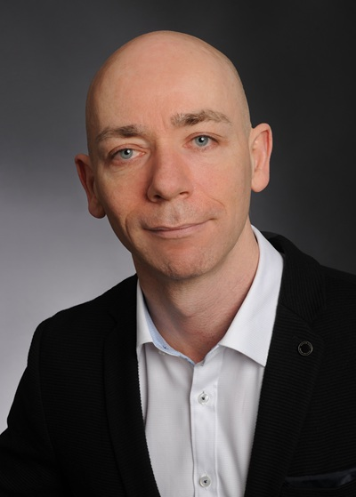

<link rel="stylesheet" href="style.css">

> ###  Resume-as-Code
> Dieses Repository dient als versionierte Basis für meinen professionellen Werdegang als **Dipl.-Wirtsch.-Inform. (FH)**.
> - **CI/CD:** Automatisierte PDF-Generierung via GitHub Actions bei jedem Commit.
> - **Tech-Stack:** Markdown & CSS für maximale Portabilität und sauberes Design.
> - **Download:** Das fertige PDF zum Download: [cv-marco-augustin.pdf](https://github.com/marco-augustin/resume/releases/download/latest/cv-marco-augustin.pdf).

  
  

      
# Marco Augustin

Dipl.-Wirtsch.-Inform. (FH) | Team Lead & Senior Software Architect

<ul class="contact-info">
    <li> 22113 Oststeinbek </li>
    <li> +49 [auf Anfrage] </li>
    <li> m.augustin [at] dev-od.de </li>
    <li> Geb. 19.03.1980 in Güstrow </li>
</ul>

 

    
  

##  Profil

Strategischer IT-Experte mit über 20 Jahren Erfahrung in der Entwicklung hochskalierbarer Enterprise-Lösungen. Spezialisiert auf Cloud-Transformation, Microservices-Architekturen und moderne CI/CD-Prozesse. Erfahren in der Führung agiler Teams und der Modernisierung komplexer Legacy-Systeme.

##  Technische Expertise

- **Core:** C# (bis .NET 10), EF Core, WPF (MVVM Pattern) 
- **Cloud & DevOps:** MS Azure, Docker, Kubernetes, CI/CD, Azure DevOps 
- **Data & Messaging:** MS SQL Server, Oracle, MongoDB, Redis, Apache Kafka 
- **Architektur:** Microservices, Cloud-Native, REST/SOAP APIs 

&nbsp;

##  Berufserfahrung

### **Team Leiter Softwareentwicklung** | VPL Leasing GmbH

*03/2023 – heute (Hamburg)* 

- **Ergebnis:** Erfolgreiche Konzeption und Umsetzung der Systemarchitektur zur Ablösung der WPF-Legacy-Anwendung durch eine skalierbare Cloud-Lösung (C#.NET & Next.js).
- **Optimierung:** Etablierung moderner CI/CD-Pipelines und Orchestrierung mittels Docker & Kubernetes zur Steigerung der Skalierbarkeit und Time-to-Market.
- **Leadership:** Übernahme der technischen Führung und Verantwortung für fundamentale Architekturentscheidungen im Modernisierungsprojekt.

### **Senior Softwareentwickler Cloud (Backend)** | xSuite Group GmbH

*09/2022 – 02/2023 (Ahrensburg)* 

* Weiterentwicklung des bestehenden Cloud-Produktes in einer verteilten Microservices-Architektur.
* Agile Softwareentwicklung (Scrum/Kanban) unter Nutzung von Azure DevOps.
* Stack: Apache Kafka, MongoDB, Redis, Keycloak, Docker & Kubernetes.

### **Senior Softwareentwickler** | VPL Leasing GmbH

*06/2016 – 08/2022 (Hamburg)* 

* Neuentwicklung des internen Leasing-Abrechnungssystems und CRM mit C#/WPF und EF Core.
* **Compliance:** Koordination externer EDV- und Sicherheitsbeauftragter in Bezug auf BaFin-Anforderungen (MaRisk/BAIT).
* Integration komplexer Schnittstellen via SOAP und REST WebAPIs.

### **Softwareentwickler** | Simplanity GmbH

*09/2014 – 05/2016 (Hamburg)* 
* Neuentwicklung eines Tourenoptimierungsprogramms (VRP) für die ambulante Pflege (C#/WPF, MS SQL Server).

### **Softwareentwickler** | invencom GmbH

*04/2014 – 09/2014 (Homeoffice)* 

* Entwicklung von Logistiksoftware im Groovy/Grails-Framework.

### **Softwareentwickler / Projektmanager** | IT Consult Henrik Ernst GmbH

*06/2005 – 03/2014 (Pinneberg)*

* Fullstack-Entwicklung von Logistik- und MDE-Software (C#, Oracle, MS SQL).
* Projektleitung bei der Einführung von Softwarelösungen beim Kunden vor Ort.

##  Bildungsweg

* **Studium der Wirtschaftsinformatik** | Fachhochschule Wismar (09/2000 – 11/2004)
    * **Abschluss:** Dipl.-Wirtsch.-Inform. (FH)
    * **Schwerpunkte:** IT-Management, Finanzwirtschaft, SAP R3

* **Zivildienst** | Gehörlosenschule Güstrow (11/1998 – 11/1999)
* **Allgemeine Hochschulreife** | Gymnasium "Am Distelberg" (1998)

##  Sprachen

* **Deutsch:** Muttersprache 
* **Englisch:** Verhandlungssicher
